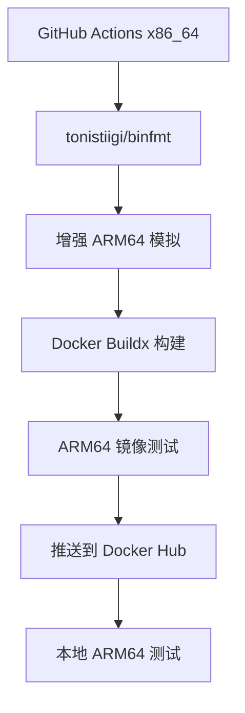

# ARM64 架构测试说明

## 🔍 **问题分析**

你遇到的错误是典型的跨架构问题：

```
no matching manifest for linux/amd64 in the manifest list entries
```

### 原因说明

1. **GitHub Actions Runner**: 运行在 x86_64 (amd64) 架构
2. **Docker 镜像**: 只构建了 ARM64 (aarch64) 版本
3. **架构不匹配**: x86_64 环境无法直接运行 ARM64 镜像

## 🛠️ **解决方案**

### 方案一：使用 tonistiigi/binfmt 增强模拟（推荐）

使用 `tonistiigi/binfmt` 提供更好的 ARM64 模拟支持：

```yaml
- name: Setup ARM64 emulation
  run: |
    docker run --rm --privileged tonistiigi/binfmt --install arm64
    docker run --rm --privileged tonistiigi/binfmt  # 验证安装

- name: Test ARM64 container
  run: |
    docker run --rm --platform linux/arm64 your-image:latest command
```

**优势：**
- 🚀 更好的性能和兼容性
- 🔧 更稳定的模拟环境
- 📦 支持更多架构特性
- ⚡ 比标准 QEMU 更快

### 方案二：标准 QEMU 模拟

```yaml
- name: Set up QEMU
  uses: docker/setup-qemu-action@v3
  with:
    platforms: arm64
```

### 方案三：修改测试策略（已弃用）

不在 GitHub Actions 中运行 ARM64 容器，而是：
- 构建时验证（Dockerfile 中的 RUN 命令）
- 推送后检查镜像 manifest
- 提供独立的 ARM64 测试工作流

### 方案四：使用 ARM64 Self-hosted Runner

如果你有 ARM64 机器，可以配置 self-hosted runner：

```yaml
runs-on: [self-hosted, linux, arm64]
```

## 🏗️ **当前实施的架构**



## ✅ **验证方法**

### 1. 使用 binfmt 本地测试（推荐）

```bash
# 使用提供的测试脚本
./test-arm64-local.sh

# 或手动设置
docker run --rm --privileged tonistiigi/binfmt --install arm64
docker run --rm --platform linux/arm64 your-image:latest
```

### 2. GitHub Actions 中测试（自动）

现在工作流已经集成了 binfmt，可以直接运行 ARM64 容器：

```yaml
- name: Setup ARM64 emulation
  run: docker run --rm --privileged tonistiigi/binfmt --install arm64

- name: Test ARM64 image
  run: |
    docker run --rm --platform linux/arm64 $IMAGE java -version
    docker run --rm --platform linux/arm64 $IMAGE libreoffice --version
```

## 🎯 **最佳实践**

### GitHub Actions 工作流设计

```yaml
jobs:
  build:
    runs-on: ubuntu-latest  # x86_64
    steps:
      # 1. 设置跨架构构建环境
      - uses: docker/setup-qemu-action@v3
        with:
          platforms: arm64
      
      # 2. 构建 ARM64 镜像
      - uses: docker/build-push-action@v5
        with:
          platforms: linux/arm64
          push: true
      
      # 3. 验证构建成功（不运行容器）
      - name: Verify build
        run: |
          docker manifest inspect $IMAGE_NAME
          echo "✅ ARM64 镜像构建成功"
  
  test:
    runs-on: [self-hosted, linux, arm64]  # 如果有 ARM64 runner
    needs: build
    steps:
      # 4. 在真实 ARM64 环境中测试
      - name: Test functionality
        run: |
          docker run --rm $IMAGE_NAME java -version
```

## 🔧 **调试技巧**

### 检查镜像架构
```bash
# 查看镜像支持的架构
docker buildx imagetools inspect cmming/arm-centos79-java8-libreoffice:latest

# 输出示例：
# linux/arm64
```

### 本地跨架构测试

```bash
# 使用 tonistiigi/binfmt（推荐）
docker run --rm --privileged tonistiigi/binfmt --install arm64
docker run --platform linux/arm64 -it your-image:latest

# 或使用提供的测试脚本
./test-arm64-local.sh your-image:latest

# 使用标准 QEMU（较慢）
docker run --rm --privileged multiarch/qemu-user-static --reset -p yes
docker run --platform linux/arm64 -it your-image:latest
```

### binfmt vs QEMU 性能对比

| 方案 | 性能 | 稳定性 | 兼容性 | 设置复杂度 |
|------|------|--------|--------|------------|
| **tonistiigi/binfmt** | 🟢 较好 | 🟢 稳定 | 🟢 优秀 | 🟢 简单 |
| **标准 QEMU** | 🟡 一般 | 🟡 中等 | 🟡 良好 | 🟡 中等 |
| **原生 ARM64** | 🟢 最佳 | 🟢 最佳 | 🟢 完美 | 🔴 需要硬件 |

## 📈 **推荐的测试策略**

1. **CI/CD 阶段**: 构建验证 + 推送
2. **预发布阶段**: ARM64 环境功能测试
3. **生产阶段**: 用户反馈 + 监控

这样既保证了 CI/CD 的效率，又确保了最终产品的质量。